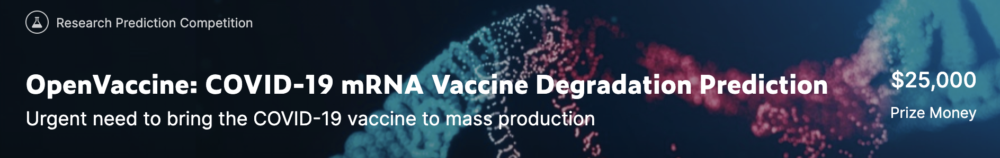
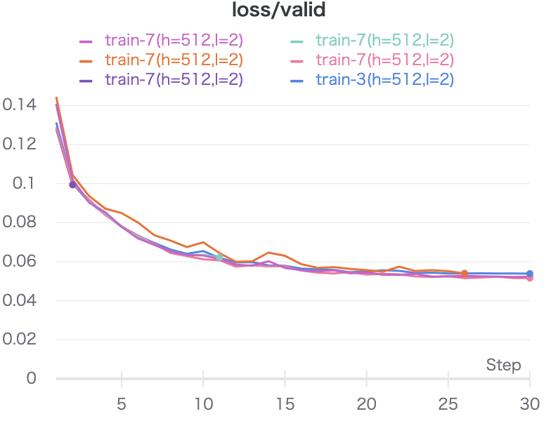

# OpenVaccine

Kaggle diary for COVID-19 mRNA Vaccine Degradation Prediction
このリポジトリはSantaコンペ2020のKaggle日記です(コンペ後に作成)。

## コンペ情報
RNAの配列情報から、反応性などの情報を予測するコンペ

## timeline
2020 9/11 started
2020 9/15 joined
2020 10/7 closed

## 成績
1159/1636 Top71%

## 解法まとめ

配列情報は時系列データであると考えられるので、時系列予測のためのニューラルネットワークモデルである、LSTMとGRUを用いて予測結果を出し、アンサンブルを行って予測値を得た。DNAの配列に関する特徴量である`sequence`,`structure`,`predicted_loop_type`をembeddingして（この部分は公開カーネルのプログラムを拝借した）、入力に用いた。後半はこれに加えて`bpp_max`,`bpp_mean`という特徴量を加えたものの、スコアは向上しなかった。

アンサンブルでは単純に平均値をとった。

## 感想
初めて自分の力で(とはいえ人のプログラムをだいぶ使用しているが)取り組んだコンペであり、LSTMやGRUなどの機械学習の手法に触れることができた。しかしながら、引き出しが乏しかったため、早々の段階でアイデアが尽きてしまい、(Transformerの存在自体知らなかった)メダルを狙うことは到底叶わなかった。
また、初めてwandbを使って実験管理を行った。

